# Arquitetura Técnica e Fluxos de Dados — Painel Pessoal Lucas

Este documento apresenta a especificação técnica detalhada da arquitetura do **Painel Pessoal Lucas**, cobrindo o modelo de dados PostgreSQL (Supabase), estratégias de autenticação, padrões de código, comandos, consultas, integrações e os **14 fluxos de dados obrigatórios** ilustrados com diagramas Mermaid.

---

## 1. Visão Geral da Arquitetura

O sistema é construído como uma aplicação monolítica modular sob o framework **Next.js 16 (App Router)** em TypeScript estrito, utilizando os conceitos de **Clean Architecture** e **Domain-Driven Design (DDD)**.

### Camadas da Aplicação
1. **Apresentação (UI & Route Handlers)**: Server e Client Components React 19, formulários controlados, modais globais e handlers de API sob `src/app/api/`.
2. **Aplicação (Commands & Queries)**: Casos de uso desacoplados por módulo (`src/modules/*/{application, domain}`). Os Commands realizam validações Zod, persistem dados nos repositórios e emitem `DomainEvent`s. As Queries agregam dados para consumo na UI.
3. **Domínio**: Entities, Enums, Schemas Zod e regras de negócio puras (ex: motor de recorrências `recurrence-engine.ts`).
4. **Infraestrutura & Plataforma**: Clientes Supabase (Browser, Server, Admin), OAuth Google, criptografia AES-256-GCM, SDK da OpenAI, adaptadores de e-mail e executores de automação idempotentes.

---

## 2. Modelo de Banco de Dados e Segurança (PostgreSQL / Supabase)

O banco de dados PostgreSQL é composto por **22 tabelas**, todas protegidas por **Row Level Security (RLS)** com isolamento por `workspace_id`.

### Estrutura de Tabelas e Relacionamentos

```
[workspaces] ──< [workspace_members] >── [profiles] (1:1 auth.users)
     │
     ├──< [projects]
     ├──< [items] ──< [item_relations]
     │       │
     │       ├──< [calendar_event_links]
     │       └──< [reminders]
     │
     ├──< [daily_plans] ──< [daily_plan_items]
     ├──< [source_documents]
     ├──< [execution_plans] ──< [plan_phases]
     │       │                └──< [plan_actions]
     │       └──< [recurrence_rules]
     │
     ├──< [domain_events]
     ├──< [ai_runs]
     ├──< [automation_runs]
     ├──< [integration_accounts] ──1:1── [integration_tokens] (Sem RLS p/ client)
     └──< [workspace_settings]
```

### Funções Helper SQL e Triggers
- `public.set_updated_at()`: Trigger function para atualização automática do campo `updated_at`.
- `public.is_workspace_member(ws_id uuid)`: Função `SECURITY DEFINER` (para evitar recursão RLS) que verifica se o usuário autenticado (`auth.uid()`) pertence ao workspace.
- `public.handle_new_user()`: Trigger function em `auth.users` que instancia o `profile` e o workspace "Pessoal" padrão com papel `owner`.
- `public.ensure_personal_workspace()`: RPC `SECURITY DEFINER` estritamente concedida à role `authenticated` (conforme migration `20260722150000_workspace_function_grants.sql`) que garante o provisionamento idempotente do workspace do usuário.

---

## 3. Diagramas Mermaid de Fluxo de Dados (14 Fluxos Factuais)

### Diagrama 1: Arquitetura Geral do Sistema
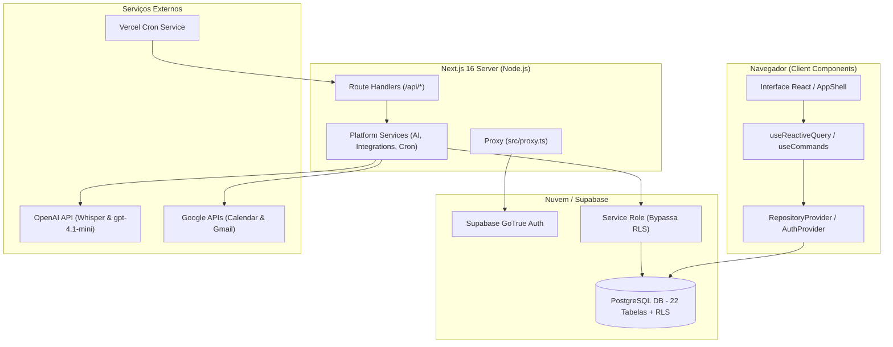

---

### Diagrama 2: Fluxo de Leitura (`useReactiveQuery`)
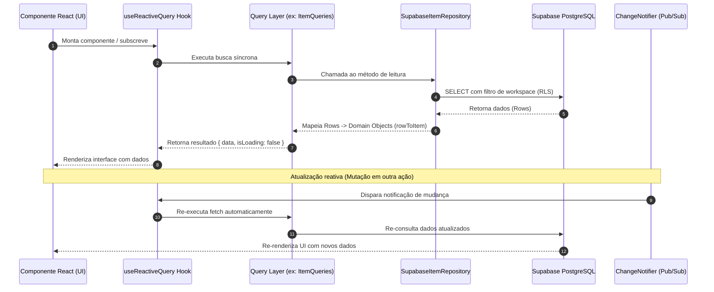

---

### Diagrama 3: Fluxo de Escrita (Commands -> Repositories -> Supabase)
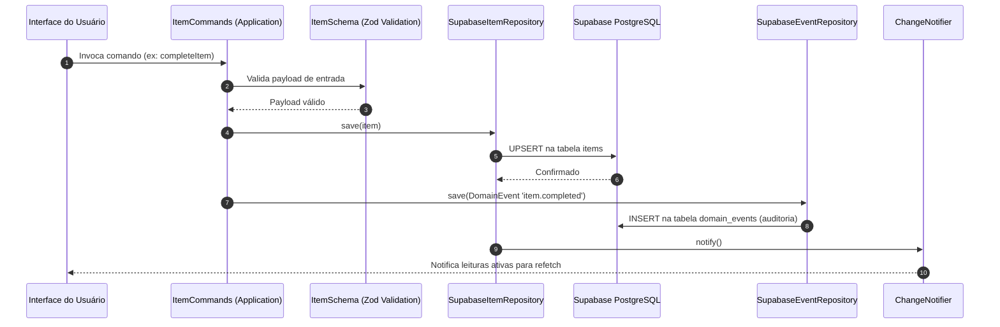

---

### Diagrama 4: Autenticação e Resolução de Workspace
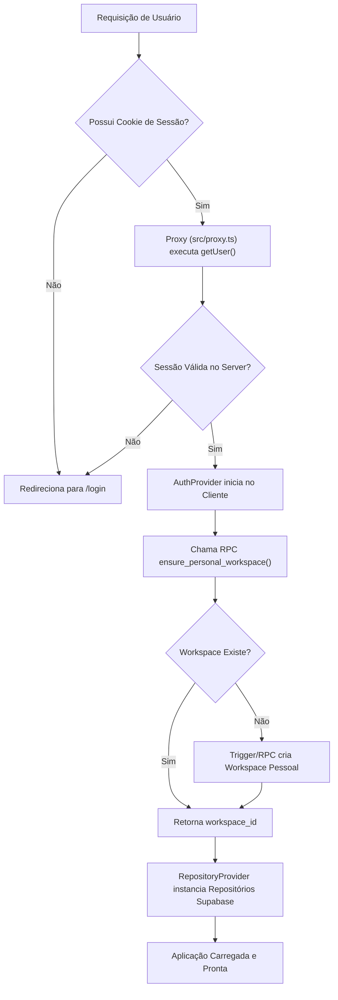

---

### Diagrama 5: Captura Rápida por Texto
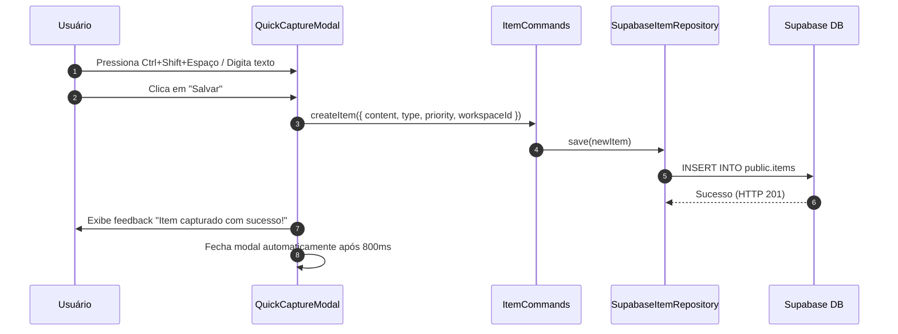

---

### Diagrama 6: Captura por Áudio (Gravação e Upload)
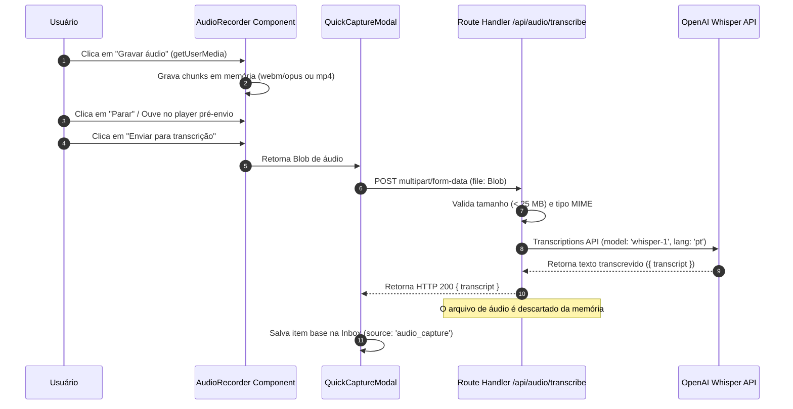

---

### Diagrama 7: Transcrição e Triagem com IA
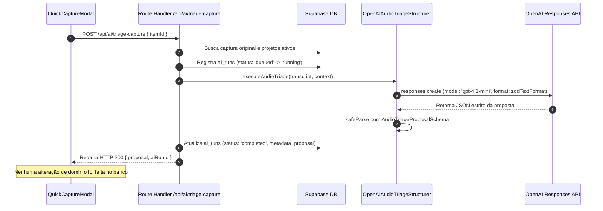

---

### Diagrama 8: Confirmação de Ações Propostas pela IA
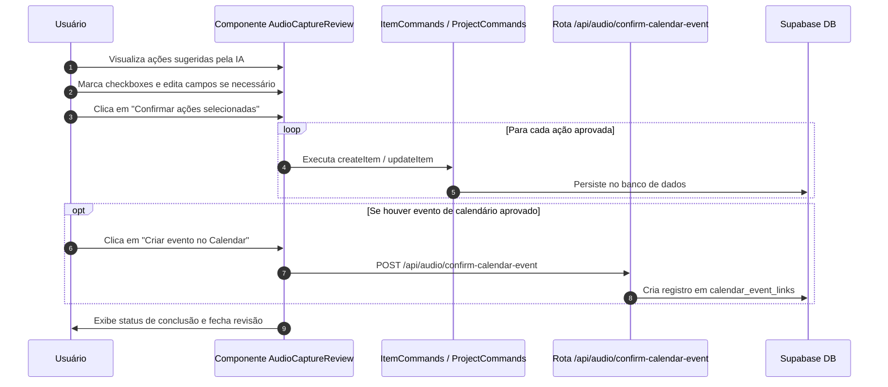

---

### Diagrama 9: Criação de Evento no Google Calendar
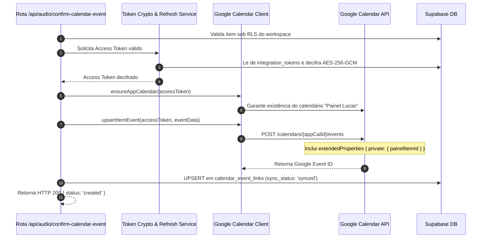

---

### Diagrama 10: Importação e Processamento de Planos
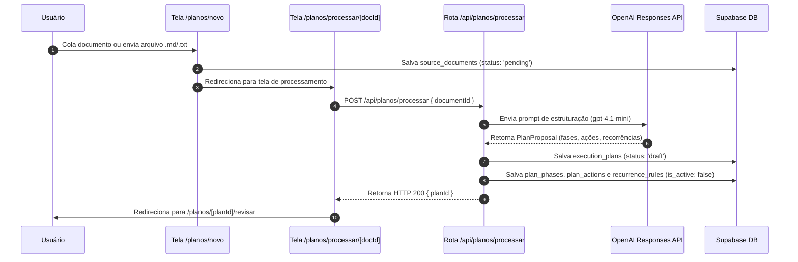

---

### Diagrama 11: Recorrências e Materialização de Itens
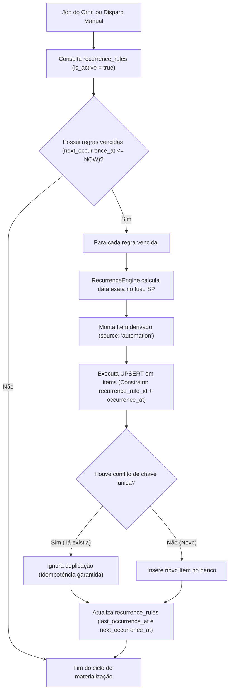

---

### Diagrama 12: Cron e Automações Horárias
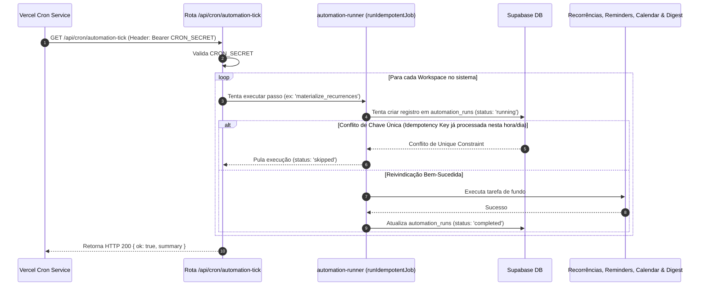

---

### Diagrama 13: Gmail e Envio de Resumos (Digests)
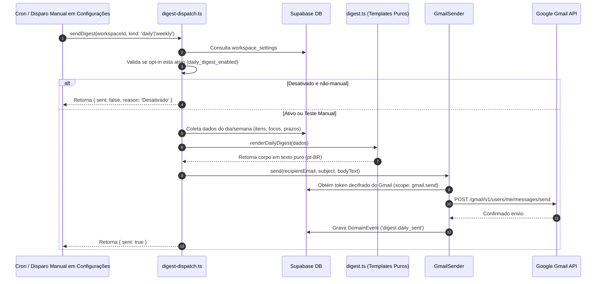

---

### Diagrama 14: Migração de Dados Locais para a Nuvem
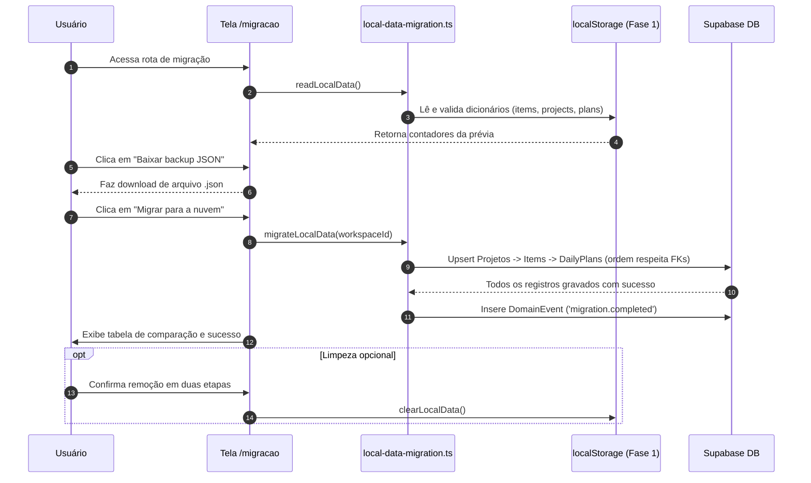

---

## 4. Inventário completo de tabelas (colunas, chaves, RLS) — Confirmado pelo banco (via migration)

Todas as 22 tabelas têm RLS **ativa**. Convenção: `is_workspace_member(workspace_id)` (SECURITY DEFINER) é a condição-padrão de quase toda policy. Soft-delete via `archived_at`/`deleted_at` só existe em `projects`, `items`, `source_documents`, `execution_plans`; as demais tabelas fazem delete físico ou não permitem delete pelo cliente.

| Tabela | Colunas-chave (além de id/workspace_id/created_at/updated_at) | PK/Unique/Índices notáveis | Acessível pelo cliente (`authenticated`) | Migration |
|---|---|---|---|---|
| `profiles` | email, full_name, avatar_url, timezone | PK=id (FK auth.users) | select/update do próprio registro | core_schema |
| `workspaces` | name, created_by | PK=id | select (membros), update (só owner) | core_schema |
| `workspace_members` | user_id, role (`owner`\|`member`) | unique(workspace_id,user_id) | somente select | core_schema |
| `projects` | name, description, objective, status, attention_level, next_milestone, due_at, archived_at, deleted_at | idx workspace (parcial `deleted_at is null`) | CRUD completo | core_schema |
| `items` | title, content, type, status, priority, due_at, scheduled_at, estimated_minutes, next_action, source, completed_at, archived_at, deleted_at, execution_plan_id, plan_phase_id, plan_action_id, recurrence_rule_id, occurrence_at, calendar_sync, audio_duration_seconds | **unique(recurrence_rule_id, occurrence_at)** — idempotência de recorrência; idx status/project/plan | CRUD completo | core_schema (+ plans_schema, integrations, audio_capture) |
| `daily_plans` | date | unique(workspace_id, date) | CRUD completo | core_schema |
| `daily_plan_items` | daily_plan_id, item_id, position | unique(daily_plan_id, item_id) | CRUD completo | core_schema |
| `item_relations` | from_item_id, to_item_id, relation_type | unique(from_item_id,to_item_id,relation_type) | CRUD completo | core_schema |
| `domain_events` | type, entity_id, source, payload (jsonb) | idx (workspace,created_at desc); sem coluna updated_at | select/insert apenas (**append-only**) | core_schema |
| `source_documents` | title, document_type, original_content, content_hash, source, processing_status, deleted_at | idx workspace parcial | CRUD completo | plans_schema |
| `execution_plans` | name, objective, status, start_date, target_date, timezone, approved_at, archived_at, deleted_at, calendar_sync_scope | idx workspace/project parcial | CRUD completo | plans_schema (+ integrations) |
| `plan_phases` | execution_plan_id, name, position, start_offset_days, duration_days, milestone, success_criteria | idx (execution_plan_id,position) | CRUD completo | plans_schema |
| `recurrence_rules` | execution_plan_id, frequency, interval, days_of_week, day_of_month, local_time, timezone, start_at, end_at, max_occurrences, next/last_occurrence_at, is_active | idx `next_occurrence_at where is_active` | CRUD completo | plans_schema |
| `plan_actions` | execution_plan_id, phase_id, title, action_type, priority, estimated_minutes, due_rule (jsonb), schedule_rule (jsonb), recurrence_rule_id, dependency_action_ids[], waiting_on, requires_confirmation, position | idx (execution_plan_id,position) | CRUD completo | plans_schema |
| `reminders` | item_id, plan_action_id, message, remind_at, channel, status | idx `remind_at where status='pending'` | CRUD completo (mas **sem Zod dedicado** — lido/escrito snake_case direto pelo cron) | plans_schema |
| `notifications` | type, title, body, entity_type, entity_id, read_at | idx unread parcial | CRUD completo | plans_schema |
| `ai_runs` | source_document_id, execution_plan_id, item_id, provider, model, operation, prompt_version, input_hash, started/completed_at, status, tokens, estimated_cost, latency_ms, error_code/message, response_metadata (jsonb) | idx workspace/plan/document/item | select/insert/update — **sem delete** (histórico auditável) | ai_runs (+ audio_capture para item_id) |
| `integration_accounts` | user_id, provider, service, external_account_email, scopes[], status, last_error, app_calendar_id | unique(workspace_id,provider,service) | CRUD completo (metadados, nunca tokens) | integrations |
| `integration_tokens` | integration_account_id, access/refresh_token_encrypted, access_token_expires_at, token_type | unique(integration_account_id) | **NENHUM acesso — só service_role** | integrations |
| `calendar_event_links` | item_id, google_calendar_id, google_event_id, etag, last_synced_at, sync_status, last_error | unique(item_id); unique(google_calendar_id,google_event_id) | CRUD completo | integrations |
| `workspace_settings` | daily/weekly_digest_enabled+time(+day), critical_alerts_enabled, digest_recipient, timezone | unique(workspace_id) | select/insert/update — sem delete | digest_settings |
| `automation_runs` | automation_type, idempotency_key, scheduled_for, started/completed_at, status, attempt, input/result (jsonb), error_code/message | **unique(workspace_id, automation_type, idempotency_key)** — base da idempotência do cron | **somente select** (escrita só via `service_role`) | automation_runs |

### Funções/RPCs (todas `SECURITY DEFINER` exceto a primeira)

| Função | Tipo | Propósito |
|---|---|---|
| `set_updated_at()` | trigger | Atualiza `updated_at = now()` em toda tabela com o trigger associado |
| `is_workspace_member(ws_id uuid)` | RLS helper (`stable sql`) | Evita recursão de RLS em `workspace_members`; base de quase toda policy do sistema |
| `handle_new_user()` | trigger em `auth.users` | Bootstrap: cria `profiles` + workspace "Pessoal" + membership `owner` para todo novo usuário |
| `ensure_personal_workspace()` | RPC chamável pelo cliente | Fallback idempotente para contas sem workspace; `EXECUTE` restrito a `authenticated` desde a migration `workspace_function_grants` (a migration anterior revogava de `anon` mas esquecia de revogar de `PUBLIC`, deixando a função tecnicamente chamável por `anon` via herança — corrigido) |

### Migrations de GRANT (`api_role_grants`, `workspace_function_grants`)

O projeto Supabase foi criado com "exposição automática de novas tabelas" desativada — as migrations de schema (1-6) criaram RLS/policies corretamente, mas nunca concederam os privilégios base de PostgreSQL (`GRANT`) que `authenticated`/`service_role` precisam para sequer tentar uma operação (sem `GRANT`, o Postgres nega **antes** de avaliar RLS). Isso produzia `permission denied for table projects` em produção. A migration `api_role_grants` corrige isso tabela por tabela (replicando o que a RLS já permitia); `service_role` recebe grants adicionais específicos para o que o cron precisa tocar (`workspaces`, `automation_runs`, `recurrence_rules`, `plan_actions`, `items`, `reminders`, `notifications`, `integration_accounts`, `integration_tokens`, `calendar_event_links`, `workspace_settings`, `daily_plans`, `domain_events`). `anon` não recebe privilégio em nenhuma tabela pessoal — a única rota pública que não exige sessão, `/api/health`, não toca o banco.

## 5. Camadas — responsabilidades e desvios observados

| Camada | Responsabilidade pretendida | Desvio real observado |
|---|---|---|
| UI (`src/app`, `src/components`) | Só chama `useCommands()`/`useQueries()`, nunca acessa storage direto | `src/modules/migration/local-data-migration.ts` acessa `window.localStorage` diretamente (é o próprio mecanismo de migração — exceção intencional); `auth.provider.tsx` usa `window.sessionStorage` só para diagnóstico não sensível |
| Application (Commands/Queries) | Toda escrita valida com Zod e emite `DomainEvent` via `EventRepository` | 3 pontos gravam eventos direto no Supabase, pulando `EventRepository`: `execution_plan.draft_created` (`app/api/planos/processar/route.ts`), `migration.completed` (`local-data-migration.ts`), `digest.*_sent` (`digest-dispatch.ts`) |
| Infrastructure (Repositories) | Uma implementação por interface, injetada via `RepositoryProvider` | `items`/`projects`/`planning` têm 2 implementações (localStorage legado + Supabase); `plans` só tem Supabase — nunca teve localStorage |
| Platform (`ai`, `integrations`, `mcp`) | Contratos + implementações reais | 3 contratos nunca implementados: `ai.provider.ts` (genérico, não usado pelas 3 operações reais de IA), `mcp.registry.ts`, `integration.adapter.ts` (webhooks genéricos) |

Nenhum ponto único de falha crítico foi identificado que não tenha mitigação: falhas de Calendar/Gmail/IA são sempre isoladas (a captura em si nunca é perdida por falha de integração — princípio confirmado em múltiplos comentários de código); a exceção é que a chamada real a `whisper-1` (transcrição) não é auditada em `ai_runs` (lacuna de observabilidade, não de disponibilidade).
